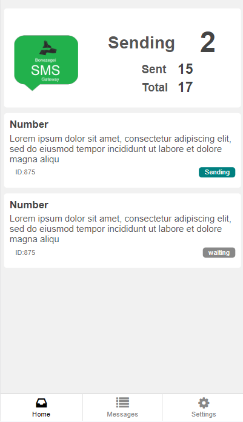
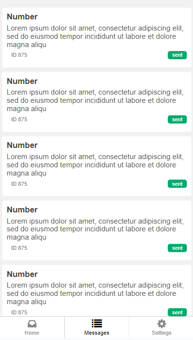
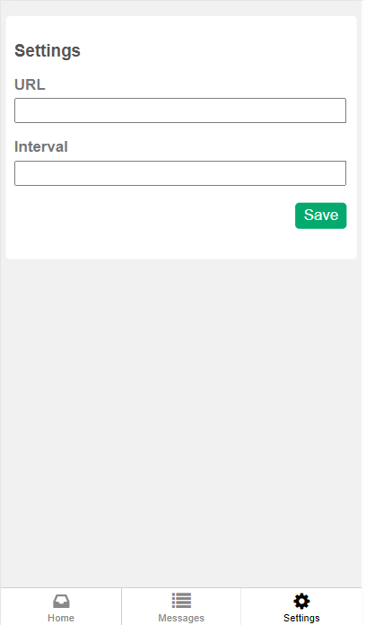

# Bonezegei-SMS
<h2> Author: Jofel Batutay </h2>

### Simple Self Hosted SMS Gateway

Bonezegei SMS Gateway is the Android application that transforms your smartphone into a versatile SMS gateway. With Bonezegei, you can harness the power of your mobile device to send and receive SMS messages programmatically, enabling a wide range of possibilities for businesses, developers, and individuals. Whether you're looking to automate SMS notifications, build interactive SMS applications, or streamline communication processes, Bonezegei SMS Gateway offers a user-friendly and reliable solution.

### Screenshot

||||
|-----|-----|---|

### Avialable on

# Usage
There 2 parameters in the settings, the URL and Interval.

1. <strong>URL</strong> is the callback file (php) where the app gets and sets the sms updates.
2. <strong>Interval</strong> is the interval time in seconds the app gets the updates. Input only the digit. 10 seconds is a good parameter. 

Create a php file to create the database for php. You can modify the sample code below. input the URL to the URL on the settings. Example http://localhost/sms.php

    <?php
      /**
         * Author : Jofel Batutay (Bonezegei)
         * Date: October 2023
         * Database for Bonezegei SMS API
      */
      
      $servername = "localhost";
      $username = "root";
      $password = "";
      $dbname = "sms";
      
     // Create connection
     $conn = new mysqli($servername, $username, $password, $dbname);
  
    if ($conn->connect_error) {
      die("Connection failed: " . $conn->connect_error);
    }
  
    // sql to create table
    $sql = "CREATE TABLE Messages (
      msg_id INT(6) UNSIGNED AUTO_INCREMENT PRIMARY KEY,
      msg_phone   VARCHAR(30)  NOT NULL,
      msg_message VARCHAR(256) NOT NULL,
      msg_status  VARCHAR(30)  NOT NULL,
      msg_time    TIMESTAMP DEFAULT CURRENT_TIMESTAMP ON UPDATE CURRENT_TIMESTAMP
    )";
  		
    // check if table is already created
    if ($conn->query($sql) === TRUE) {} 
    else {}
  
    header('Access-Control-Allow-Origin: *'); 
    header("Access-Control-Allow-Credentials: true");
    header('Access-Control-Allow-Methods: GET, PUT, POST, DELETE, OPTIONS');
    header('Access-Control-Max-Age: 1000');
  
    if(isset($_GET['update'])){
  	   $ms_id=$_GET['update'];
  	   $ms_status=$_GET['status'];
  	   $sql = "UPDATE Messages SET msg_status='$ms_status' WHERE msg_id=$ms_id";
  	   if ($conn->query($sql) === TRUE) {
  	     echo "msg_status:updated";
  	   } else {
  	     echo "Error: " . $conn->error;
    	 }
    }
    else{
     $sql = "SELECT msg_id, msg_phone, msg_message, msg_status, msg_time FROM Messages";
     $result = $conn->query($sql);
  	 $data_count = 0;
   
  	 if ( $result !== false && $result->num_rows) {
  	   echo "{ \n \"Messages\": [\n  ";
     
  	   while($row = $result->fetch_assoc()) {
        if($data_count>0){
          echo ",\n  ";
        }
        echo "{";
        echo " \"msg_id\":".$row["msg_id"].",\n";
        echo "    \"msg_phone\": \""  .$row["msg_phone"]."\",\n";
        echo "    \"msg_message\": \"".$row["msg_message"]."\",\n";
        echo "    \"msg_status\": \"" .$row["msg_status"]."\",\n";
        echo "    \"msg_time\": \""   .$row["msg_time"]."\"";
        echo "}";
        $data_count++;
  	   }
  	  echo "\n ]\n}";
  	 } 
    else {
  	  echo "0 results";
  	 }
    }
    $conn->close(); ?>

### Privacy Policy
https://app.bonezegei.com/bonezegeisms/policy.html

